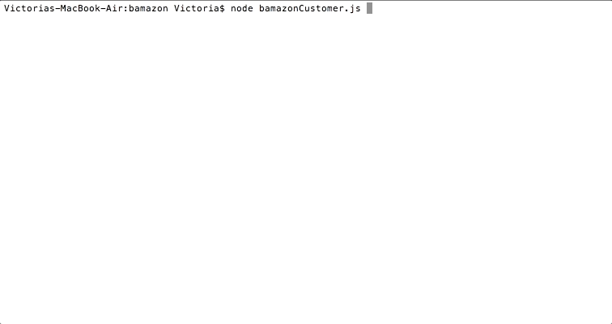
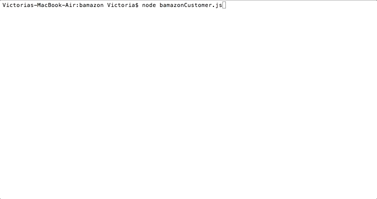
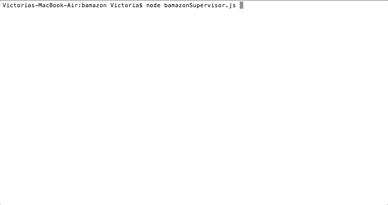

# Bamazon CLI App

## Overview

This application has three different flows - client, manager, and supervisor - with different options accessible to each related to a hypothetical online store. 

### Customer

The customer should be able to see the products that are available for sale, and then to make a purchase.

If a product does not have enough stock to sell the customer the full quantity requested, a message "Insufficient Quanitity" will be returned.

### Manager

The manager should be able to 
    
  * View the products for sale:
        
 
  * View products that have a low inventory (there is also an option to move directly into the restock flow if an item with a low inventory exists): 
        
    
    *If there are no products with a low inventory, the manager should not have the option to add inventory. Instead they will be sent back to the main menu.
        
 
  * Add stock to a product:
        
 
  * Add an entirely new product:
        

### Supervisor

The Supervisor should be able to

  * View the total profits by department in a table format (this should display the department even if no products have yet been added to it):
        

  * Add an entirely new department:
        